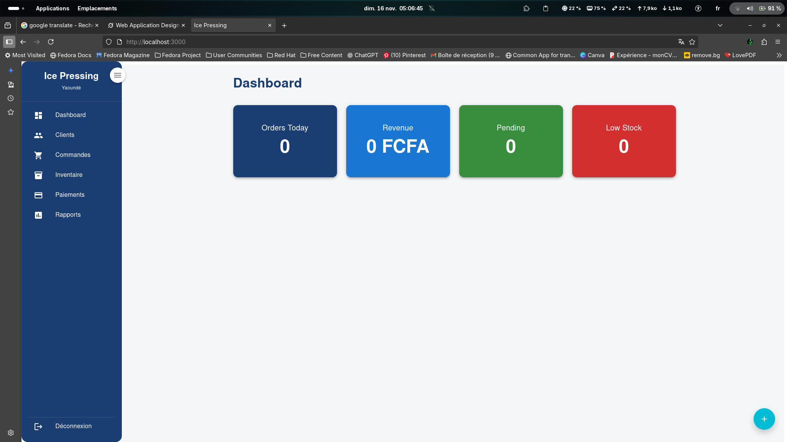

Professional and BILINGUAL

# Ice Pressing – Dry Cleaning Management System

**Yaoundé, Cameroon** | **React + Node.js + SQLite**

[](http://your-vercel-url.vercel.app)

---

## Features

- **Customer Management** (CRUD + Email Alerts)
- **Order System** (Multi-item, Auto-total)
- **Inventory Tracking** (Low Stock Alerts)
- **Payments** (Cash, Mobile Money)
- **Reports Dashboard**
- **Responsive + Animated UI**
- **Bilingual (EN/FR)**

---

## Tech Stack

| Layer | Tech |
|------|------|
| Frontend | React, MUI, Framer Motion |
| Backend | Node.js, Express, SQLite |
| Auth | JWT |
| Email | Nodemailer + Gmail |

---

## Setup

SCREENSHOTS
 "DASHBOARD"


```bash
# Backend
cd backend && npm install && node server.js

# Frontend
cd frontend && npm install && npm start

Login: admin / password123


